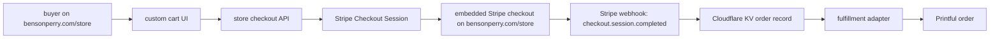

# Embedded checkout plan

This is the implementation plan for replacing Fourthwall-hosted checkout links with an on-page checkout at `bensonperry.com/store`.

## Target architecture



## API surface

- `GET /api/store/config`
  - Returns public checkout configuration, including the Stripe publishable key when configured.
  - Reports card, Stripe wallet, Link, and optional Shop Pay readiness.
- `POST /api/store/checkout-session`
  - Validates product IDs, variant IDs, quantities, and prices against `store/products.json`.
  - Creates a Stripe Embedded Checkout Session.
  - Returns the session client secret for Stripe.js.
- `GET /api/store/session-status?session_id=...`
  - Lets the return page show whether checkout completed.
- `GET /api/store/order-status?session_id=...`
  - Reads the fulfillment idempotency record for a paid Stripe session.
  - Lets the return page distinguish queued, processing, failed, and missing provider handoff states.
- `POST /api/store/webhook/stripe`
  - Verifies the Stripe webhook signature.
  - On successful payment, decodes the cart metadata and hands the order to the Printful fulfillment adapter.
  - Uses the `STORE_ORDERS` Cloudflare KV namespace to avoid duplicate Printful orders on repeated Stripe webhook delivery.

## Current backend deployment

The checkout API Worker is deployed at:

- `https://benson-store-checkout-api.bensonperry.workers.dev/api/store/config`

The preferred production route is:

- `https://bensonperry.com/api/store/*`

Attaching that route currently needs a Cloudflare API token with Workers Routes edit permission for the `bensonperry.com` zone. Until then, the frontend can call the workers.dev API host while the customer remains on `bensonperry.com/store`.

The Worker has a `STORE_ORDERS` KV namespace bound for fulfillment idempotency:

- `b3fa6b8d6c1b457d80fd53ad5324d18c`

Each paid Stripe checkout session writes `stripe:{session_id}:fulfillment` before calling Printful and updates it after provider order creation. Duplicate `checkout.session.completed` webhook deliveries return the stored record instead of creating another provider order.

The storefront return flow also reads that record through `/api/store/order-status`. If Stripe says payment succeeded but the provider handoff has not appeared yet, the buyer still sees a received/pending message instead of a false fulfillment success.

## Product manifest additions

Each sellable product should expose:

- `variants`: store-owned variant IDs, labels, option names, price, SKU, and availability.
- `checkout`: checkout strategy and shipping policy.
- `fulfillmentMapping`: provider-specific product/variant/template mapping.

The frontend only sends store-owned product IDs and variant IDs. The backend is responsible for prices and fulfillment mappings so buyers cannot manipulate checkout amounts.

The current `small-useful-light-tee` is mapped to Printful catalog product `1421`, `Unisex Fine Jersey Tee | LAT Apparel 6901`, with black size variants:

| Store variant | Printful catalog variant |
| --- | --- |
| `small-useful-light-black-s` | `44067` |
| `small-useful-light-black-m` | `44077` |
| `small-useful-light-black-l` | `44087` |
| `small-useful-light-black-xl` | `44097` |
| `small-useful-light-black-2xl` | `44107` |

## MVP choice

Start with Stripe Embedded Checkout and US-only shipping. Prefer "shipping included" pricing for the first product because it keeps the first checkout flow simple and avoids building live shipping-rate recalculation before the provider is finalized.

Stripe's current embedded Checkout docs use `ui_mode=embedded_page` and `stripe.createEmbeddedCheckoutPage(...)`. The frontend calls `createEmbeddedCheckoutPage` when available and falls back to `initEmbeddedCheckout` for older Stripe.js behavior.

When fulfillment credentials exist, the webhook should create a provider draft order first and only confirm it after the Stripe payment is complete.

## Wallet support

The Stripe Checkout Session explicitly enables `card`, which is the base requirement for card entry and card-backed wallets in Stripe Checkout. The config endpoint reports:

- `payments.card`: card checkout through Stripe.
- `payments.wallets.applePay`: Apple Pay eligibility marker. Production still requires Stripe/domain wallet readiness and a supported browser/device.
- `payments.wallets.googlePay`: Google Pay eligibility marker. Production still requires Stripe payment-method readiness and a supported browser/device.
- `payments.wallets.link`: Stripe Link eligibility marker.
- `payments.shopPay`: optional Shopify Shop Pay Wallet lane. This is separate from Stripe and still requires Shopify setup.

The buyer remains on `bensonperry.com/store`; Stripe's secure embedded checkout frame handles payment data.

## Why not deploy this over the current buy path yet?

The current Fourthwall path is live and buyable. The embedded checkout path should not replace it in production until Stripe and fulfillment credentials are configured and a real provider order can be created after payment.

## Required Worker secrets

The Worker is deployed, but payment is intentionally disabled until these secrets exist:

```powershell
npm run store:checkout:setup
```

That command checks ignored local env files and the Stripe CLI profile without printing secret values. Once Stripe and Printful credentials exist locally, it can create the Stripe webhook endpoint, write the generated webhook secret to `.env.local`, and deploy Worker secrets:

```powershell
npm run store:checkout:setup -- --create-webhook --write-local --deploy
```

If a Stripe CLI claimable sandbox exists, the setup command prints the claim URL. Claim the sandbox or log into Stripe, add `PRINTFUL_API_KEY` to `.env.local`, then rerun the setup command.

Manual fallback:

```powershell
npx wrangler secret put STRIPE_PUBLISHABLE_KEY --config wrangler.store-checkout.jsonc
npx wrangler secret put STRIPE_SECRET_KEY --config wrangler.store-checkout.jsonc
npx wrangler secret put STRIPE_WEBHOOK_SECRET --config wrangler.store-checkout.jsonc
```

Wallet readiness markers after the Stripe dashboard/domain setup is complete:

```powershell
npx wrangler secret put STRIPE_WALLET_DOMAIN_READY --config wrangler.store-checkout.jsonc
npx wrangler secret put STRIPE_PAYMENT_METHODS_READY --config wrangler.store-checkout.jsonc
```

Fulfillment requires one provider:

```powershell
npx wrangler secret put PRINTFUL_API_KEY --config wrangler.store-checkout.jsonc
```

or:

```powershell
npx wrangler secret put GELATO_API_KEY --config wrangler.store-checkout.jsonc
```

Optional Shop Pay Wallet integration would require:

```powershell
npx wrangler secret put SHOP_PAY_CLIENT_ID --config wrangler.store-checkout.jsonc
npx wrangler secret put SHOPIFY_STOREFRONT_ACCESS_TOKEN --config wrangler.store-checkout.jsonc
npx wrangler secret put SHOPIFY_ADMIN_API_ACCESS_TOKEN --config wrangler.store-checkout.jsonc
```

Only for Stripe test-mode smoke tests before fulfillment mapping exists, set:

```powershell
npx wrangler secret put STORE_ALLOW_UNFULFILLED_CHECKOUT --config wrangler.store-checkout.jsonc
```

That value should not be `true` in production.

## Fulfillment doctor

Run:

```powershell
npm run store:fulfillment:doctor
```

It checks local environment presence and every embedded-checkout product's fulfillment mapping. It intentionally exits non-zero until Stripe secrets, the Printful API key, and all provider variant IDs are configured.

## Cloudflare route blocker

The current Cloudflare token can upload Workers, but it failed to attach the route `bensonperry.com/api/store/*` with Cloudflare API error `Authentication error [code: 10000]`.

To make the API same-origin, the token needs route-edit permission for the `bensonperry.com` zone, then uncomment the `routes` section in `wrangler.store-checkout.jsonc` and redeploy.
